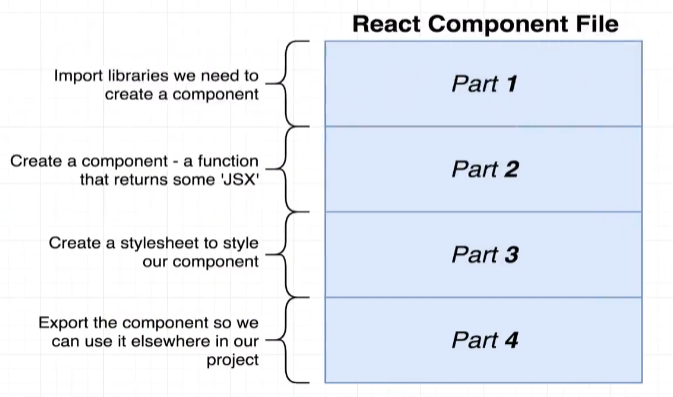

# RN_Starter

In this repo I'm registering my progress on React Native course, to remember and share to someone else who, like me, is getting started and is interested. 

* [Setup Enviroment](#setup-enviroment)
* [Getting Started](#getting-started)
* [Working with Content](#working-with-content)

## Setup Enviroment

The first step consists to configure the enviroment, for that I followed the <a href="https://reactnative.dev/docs/environment-setup">React Native Tutorial</a> to setup React Native CLI on Windows plataform. 
As suggested, I installed the <a href="https://chocolatey.org/install">Chocolatey</a>, that I used to install the OpenJDK, and <a href="https://github.com/coreybutler/nvm-windows">nvm-windows</a> to install and manage the NodeJS versions. Then, to test my applications, I installed the <a href="https://developer.android.com/studio">Android Studio</a> and setup a device. I had no idea, but all this work would be for nothing, because the course uses Expo to test the apps. I just started this one after setup my enviroment because I was moving, and would gave no network connection for a few days, and the little bit experience I had with React Native before tath required an emulator to run the applications. But anyway, this enviroment that I created certainly will be useful later on.

So, I just started the course...

## Getting Started

Initially, the instructor gave me a base project that we will use for something along the course to practice some especifical features. I downloaded, extract on my workspace directory and open that directory on terminal. Next, as instructed by the teacher, I ran the command <code>npm install --legacy-peer-deps</code> to install all project dependecies. And it's occurred all good, nothing errors! After that, I ran <code>npm start</code> to open the React Native bundler which gotten my code ready to be ran on a mobile device. Than I downloaded the Expo Go on App Store and scanned the QR code from RN Bundler and... <i>Voilà</i>! the app was running on my phone.

## Working with Content

Instructor says: "In general, every different componet file we create is gonna have the same four different parts". In the first part, we're always write the imports we need to create our component. In part two, we're gonna create the component itself. For now, understand component as "a funcion tha returns some JSX".
In third part, we're create a stylesheet to style our component. And, in the last one, we're export the component, allowing us to use it elsewhere in our project.

  

Next, I did the <a href='https://github.com/gabrielkreusch/RN_Starter/releases/tag/1.2.1'>JSX overview exercise</a>.

